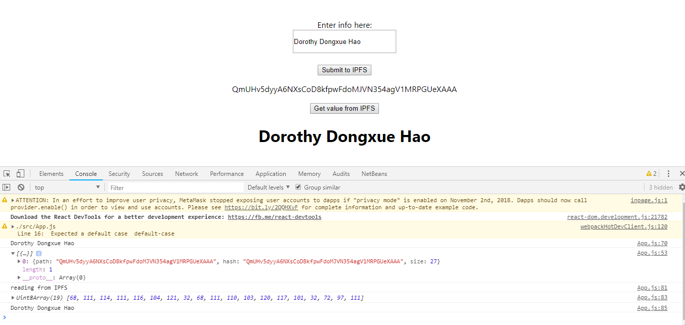

video: https://www.youtube.com/watch?v=UYrACaD6MT0 [Chinese]

1. install  react:

    `npm install -g create-react-app`

2. create a react project

    `create-react-app react-ipfs`

3. start the app

    `npm start`

4. install ipfs api to the project

    `npm install --save ipfs-http-client`

    also you can uninstall ipfs:

    `npm uninstall --save ipfs-http-client`

    install it to dev dependencies:

    `npm install --save-dev ipfs-http-client`
    
5. add ipfs constant  in app.js
    ```
    const ipfsAPI = require('ipfs-http-client');
    const ipfs = ipfsAPI({host:'localhost', port : '5001', protocol: 'http'});
     ```
6. method to save data to ipfs
    ```
    saveToIPFS = (blob) =>{
      return new Promise(function(resolve, reject){
          const descBuffer = Buffer.from(blob,'utf-8');
          //upload data to ipfs core code
          ipfs.add(descBuffer).then((response)=>{
            console.log(response);
            resolve(response[0].hash);
          }).catch((err)=>{
            console.log(err);
            reject(err);
          })
      })
   }
    ```
7. core code to read data from ipfs:
    ```
    ipfs.cat(this.state.strHash).then((stream) => {
        let strContent = Utf8ArrayToStr(stream);
        this.setState({strContent:strContent });
    });
    ```
8. Utf8ArrayToStr function link: https://stackoverflow.com/questions/8936984/uint8array-to-string-in-javascript
9. final demo:
<p></p>

10. save file/image to ipfs core code:
    ```
    saveImgToIPFS = (reader) =>{
        return new Promise(function(resolve, reject){
            const buffer = Buffer.from(reader.result);
            //upload image to ipfs core code
            ipfs.add(buffer).then((response)=>{
            console.log(response);
            resolve(response[0].hash);
            }).catch((err)=>{
            console.log(err);
            reject(err);
            })
        })
    }
    ```
11. core code to read imh/file from ipfs
    ```
    var file = this.refs.file.files[0];
    var reader = new FileReader();
    reader.readAsArrayBuffer(file)
    reader.onload=(e) =>{
        console.log(reader);
        this.saveImgToIPFS(reader).then((hash) =>{
        console.log(hash);
        this.setState({imgSrc:hash});
    });                         
    ```        